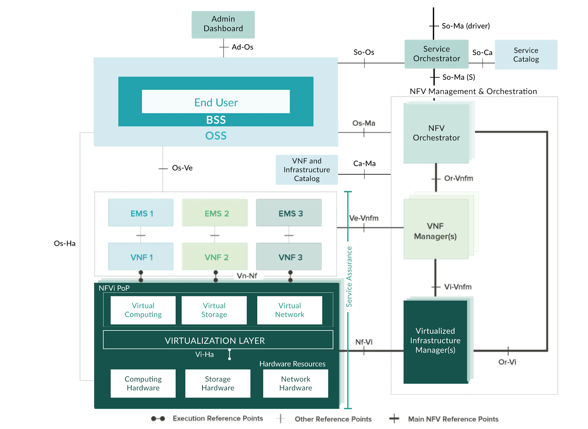
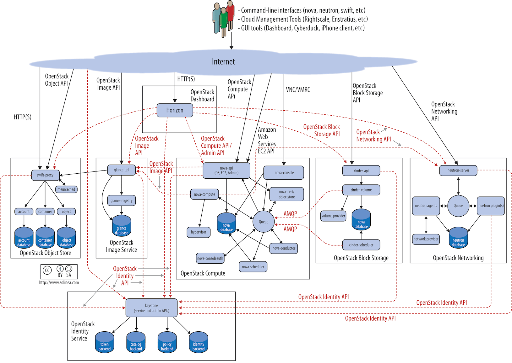
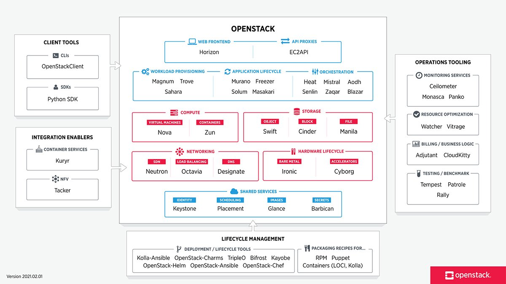
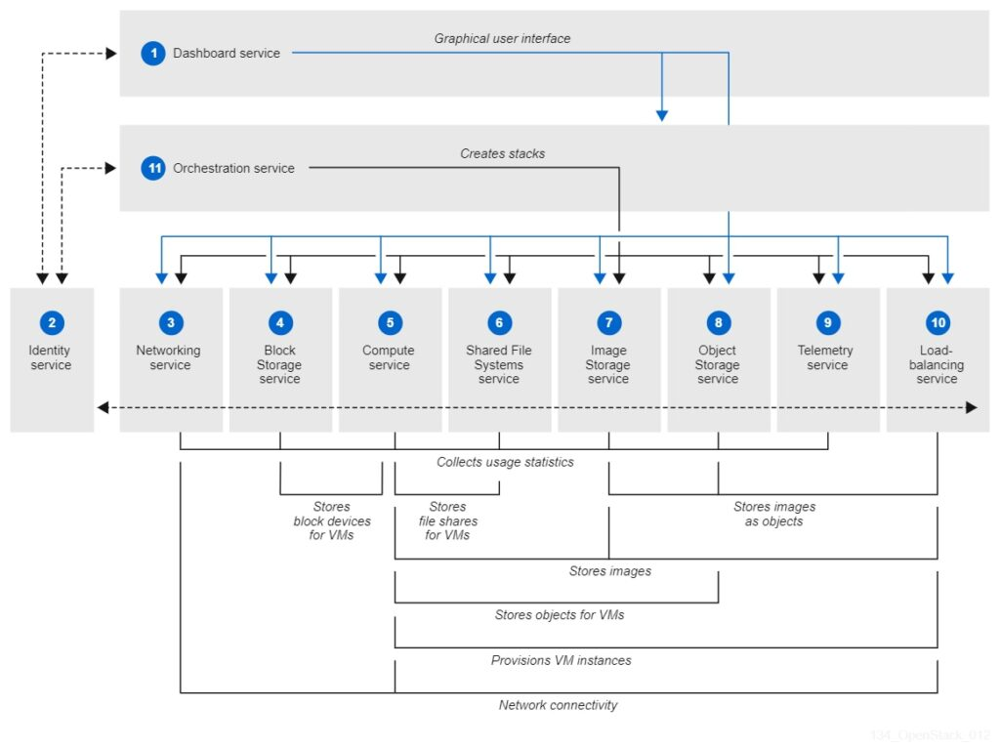
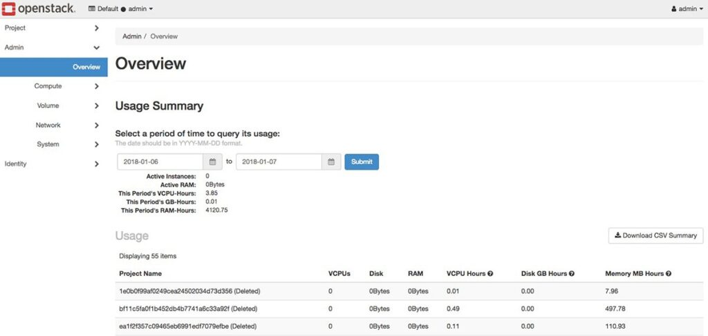
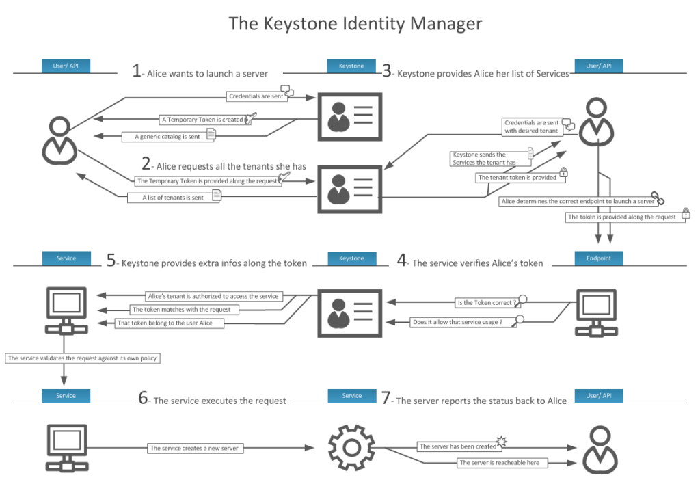

# 1. OpenStack là gì ?

OpenStack là nền tảng mã nguồn mở miễn phí cung cấp một Frame để xây dựng và quản lý cơ sở hạ tầng public cloud và private cloud

OpenStack cung cấp cơ sở hạ tầng như một dịch vụ, cấu hình và quản lý một lượng lớn tài nguyên điện toán, storage và network

Các tài nguyên này bao gồm : metal hardware, máy ảo (VM)
=> được quản lý thông qua giao diện lập trình ứng dụng (API) và bảng thông tin OpenStack

Các tổ chức và nhà cung cấp dịch vụ có thể triển khai OpenStack tại chỗ (tạo private cloud trong data center), OpenStack trong cloud để kích hoạt hoặc cung cấp năng lượng cho các nền tảng đám mây và các hệ thống network

# 2. OpenStack dùng để làm gì ?

Để tạo môi trường điện toán đám mây, các tổ chức thường xây dựng cơ sở hạ tầng ảo hóa của mình bằng cách sử dụng các hệ thống nổi tiếng như VMware vSphere, Microsoft Hyper-V hoặc KVM

Tuy nhiên, điện toán đám mây ngoài cung cấp ảo hóa public cloud và private cloud còn cung cấp khả năng tự động hóa vòng đời tự phục vụ của người dùng, báo cáo chi phí và thanh toán, đồng bộ hóa và các khả năng khác

Cài đặt phần mềm OpenStack trên môi trường ảo tạo ra một cloud operating system

Các công ty có thể sử dụng nó để tổ chức, đặt cấu hình và quản lý các nhóm tài nguyên mạng, storage và network resources khác nhau, trong khi quản trị viên CNTT thường định cấu hình và quản lý tài nguyên trong môi trường ảo truyền thống

Cơ sở hạ tầng ảo hóa được xây dựng thông qua OpenStack có rất nhiều tác dụng, bao gồm tạo web hosting, Server chứa các dự án dữ liệu lớn và các phần mềm dưới dạng dịch vụ

OpenStack cạnh tranh trực tiếp với các nền tảng đám mây mã nguồn mở khác, ví dụ như Eucalyptus và Apache CloudStack, một số người cũng coi nó như một giải pháp thay thế cho các nền tảng đám mây miễn phí như Amazon Web Services hoặc Microsoft Azure, với một số công ty về hosting, cloud nhỏ hơn sử dụng OpenStack làm nền tảng gốc dịch vụ của mình

# 3. OpenStack hoạt động như thế nào

OpenStack không phải là một ứng dụng theo nghĩa truyền thống, nhưng nó là một nền tảng được tạo thành từ hàng chục thành phần độc lập được gọi là projects, hoạt động cùng nhau thông qua các API

Các tổ chức chỉ có thể cài đặt các thành phần được chọn để tạo ra các tính năng và chức năng mong muốn trong môi trường đám mây.

OpenStack cũng dựa vào hai công nghệ nền tảng: hệ điều hành cơ bản (như Linux) và nền tảng ảo hóa (như VMware hoặc Citrix), một hệ điều hành xử lý các hướng dẫn và dữ liệu được trao đổi từ OpenStack, trong khi công cụ ảo hóa quản lý các tài nguyên phần cứng ảo được sử dụng bởi projects OpenStack.

Sau khi hệ điều hành, nền tảng ảo hóa và các thành phần OpenStack được triển khai và cấu hình đúng cách, quản trị viên có thể định cấu hình và quản lý các tài nguyên được tạo sẵn mà ứng dụng cần. Các hành động và yêu cầu được thực hiện thông qua trang tổng quan tạo ra một loạt các lệnh gọi API được xác thực bởi dịch vụ bảo mật và được chuyển đến thành phần đích. thực hiện các nhiệm vụ liên quan.

Ví dụ: administrator đăng nhập vào OpenStack và quản lý môi trường đám mây thông qua dashboard. Administrator có thể tạo mới và kết nối các phiên bản điện toán và storage mới cũng như đặt cấu hình network behaviors

Administrator cũng có thể kết nối với các dịch vụ khác, chẳng hạn như giám sát hiệu năng phiên bản được cung cấp và sử dụng tính phí và bồi hoàn tài nguyên cho dung lượng lưu trữ.

Phạm vi rộng của nền tảng OpenStack và số lượng các thành phần được kết nối với nhau có thể gây nhầm lẫn và khó khăn. Hầu hết người dùng OpenStack bắt đầu với một số lượng nhỏ các yếu tố cơ bản và dần dần triển khai các phần tử khác. Theo thời gian, để xây dựng các khả năng hoạt động và kinh doanh của đám mây của họ.

# 4. Các thành phần của Openstack

Các thiết bị này xuất phát từ sự đóng góp mã nguồn mở từ cộng đồng nhà phát triển và những người triển khai OpenStack có thể chọn sử dụng một số hoặc tất cả các thành phần này tùy thuộc vào nhu cầu kinh doanh của họ.

Hình ảnh dưới đây cho thấy tất cả các thành phần OpenStack 2021

Cài đặt OpenStack khác nhau, nhưng thường bắt đầu với một số yếu tố chính: compute (Nova), VM images (Glance), networking (neutron), storage (Cinder hoặc Swift), identity management (Keystone) và resource management (vị trí)

# 5. Ưu và nhược điểm

**Nhiều tổ chức triển khai và duy trì cơ sở hạ tầng OpenStack được hưởng lợi từ những điều sau:**

- Giá rẻ: Ideal OpenStack được phát hành dưới dạng phần mềm mã nguồn mở và miễn phí theo giấy phép Apache 2.0, có nghĩa là không có chi phí trả trước để mua và sử dụng OpenStack.
- Tin cậy: Sau gần một thập kỷ phát triển và triển khai, OpenStack cung cấp một nền tảng mã nguồn mở phong phú. Bộ tính năng bao gồm scalable storage, hiệu suất tốt và bảo mật dữ liệu cao, đồng thời được sử dụng rộng rãi.
- Trung lập: Do tính chất mã nguồn mở của OpenStack, một số tổ chức coi đó là một cách để tránh bị phụ thuộc nhà cung cấp vì toàn bộ nền tảng và khả năng của từng chức năng.

**Nhưng khách hàng tiềm năng sẽ phải xem xét một số nhược điểm, chẳng hạn như:**

- Sự phức tạp: Do quy mô và phạm vi của nó, OpenStack đòi hỏi nhân viên CNTT có kiến thức sâu rộng để triển khai nền tảng và làm cho nó hoạt động. Trong một số trường hợp, các tổ chức có thể cần thêm nhân viên hoặc công ty tư vấn để triển khai OpenStack, giúp tăng thời gian và chi phí.
- Hỗ trợ kĩ thuật: Là phần mềm mã nguồn mở, OpenStack không được sở hữu hoặc chỉ đạo bởi bất kỳ nhà cung cấp hoặc nhóm cụ thể nào. Điều này có thể gây khó khăn cho việc nhận hỗ trợ công nghệ.
- Tính nhất quán: Bộ thành phần OpenStack luôn thay đổi khi các thành phần mới được thêm vào và các thành phần khác không còn được dùng nữa.

Để đơn giản hóa việc triển khai openstack và truy cập hỗ trợ kỹ thuật trực tiếp. Các tổ chức có thể chọn bản phân phối openstack từ các nhà cung cấp. Đây là phiên bản mã nguồn mở của nền tảng được đóng gói với các thành phần khác như trình cài đặt và công cụ quản lý. Điều này thường đi kèm với một tùy chọn hỗ trợ kỹ thuật.

Tổ chức này có một  loạt các bản phân phối OpenStack để lựa chọn, bao gồm Red Hat OpenStack platform, Mirantis Cloud Platform và Rackspace OpenStack private cloud.

# 6. OpenStack so với các nền tảng đám mây khác như thế nào?

Ngay cả những nền tảng đám mây thông thường cũng phức tạp và đòi hỏi rất nhiều automation, điều phối và quản lý để hoạt động. Điều này có nghĩa là các lựa chọn thay thế thả vào của OpenStack hiếm khi thực tế và đã được chứng minh. Tuy nhiên, có những tùy chọn sẽ giúp các tổ chức kết hợp lợi ích của các chức năng đám mây và tại chỗ để đơn giản hóa hoặc đẩy nhanh việc áp dụng các công nghệ thế hệ tiếp theo tại chỗ.

VMware vCloud : Khi các tổ chức đầu tư lớn đang đầu tư vào công nghệ ảo hóa, người ta thường xem xét xây dựng một đám mây riêng bằng cách sử dụng VMware’s vCloud Suite. Tuy nhiên, phần mềm VMware độc quyền yêu cầu giấy phép và có thể cung cấp ít năng lượng và tính linh hoạt hơn so với các nền tảng mã nguồn mở như OpenStack.

Public clouds: Nhiều tổ chức tin rằng dung lượng và độ tin cậy của các dịch vụ Public clouds đáp ứng nhu cầu của họ, tránh chi phí hạ tầng doanh nghiệp vào private cloud.

# 7. Cách triển khai OpenStack

Triển khai OpenStack là một quá trình. Các công ty xây dựng private cloud trên OpenStack đòi hỏi thời gian, tài chính và hỗ trợ từ quản lý cấp cao.

Testing: Việc áp dụng OpenStack thường bắt đầu bằng đánh giá kỹ thuật, thử nghiệm để xem thiết lập OpenStack trông như thế nào và nó hoạt động như thế nào. OpenStack Public Cloud Passport cung cấp các chương trình dùng thử từ một số nhà cung cấp public cloud OpenStack. Các công ty muốn cài đặt và chạy OpenStack cục bộ để giám sát thực hành có thể sử dụng DevStack, tập trung vào các tương tác administration/user và có thể được cài đặt trên một máy tính duy nhất.

Preparation: Khi một công ty chọn áp dụng OpenStack, nó phải được chuẩn bị để đối phó với ba vấn đề sau:

- Đào tạo: Tìm hiểu thêm về các thành phần OpenStack, cách sử dụng chúng.
- Tài nguyên: Tham gia vào các dịch vụ hỗ trợ của OpenStack, từ cộng đồng hỗ trợ trực tuyến. Nhân viên kỹ thuật triển khai dịch vụ hoặc nhà cung cấp dịch vụ OpenStack.
- Cơ sở hạ tầng: Xác định cơ sở hạ tầng phần cứng ban đầu để triển khai OpenStack, có thể yêu cầu mua và cài đặt.

Các công ty nên cân nhắc bắt đầu với các project openstack giới hạn trong dịch vụ cơ bản. Ví dụ: OpenStack Compute Starter Kit chỉ tập trung vào năm thành phần: Nova (máy tính), Glance (hình ảnh VM), Keystone (quản lý danh tính) Neutron (mạng) và Place (sử dụng và theo dõi tài nguyên).

Sau khi các công ty đã có được kinh nghiệm làm việc ban đầu với OpenStack, các tổ chức có thể muốn mở rộng triển khai OpenStack của họ với các thành phần bổ sung.