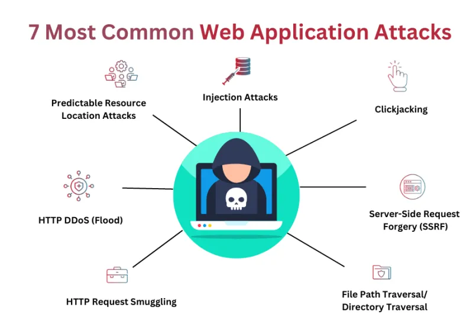

# 1. waf là gì

**WAF (Web Application Firewall)**, hay tường lửa ứng dụng web, là một thiết bị proxy xử lý giao thức HTTP/HTTPS, bảo vệ ứng dụng web khỏi các cuộc tấn công từ bên ngoài

**WAF** hoạt động bằng cách kiểm tra và lọc lưu lượng truy cập, ngăn chặn các yêu cầu độc hại trước khi chúng tiếp cận ứng dụng web
Khác với tường lửa mạng truyền thống, WAF hoạt động ở tầng ứng dụng (Layer 7) của mô hình OSI, cho phép WAF phân tích nội dung của lưu lượng HTTP/HTTPS và hiểu được các yêu cầu web phức tạp

**Tại sao cần sử dụng WAF**

- bối cảnh tấn công ứng dụng wed gia tăng
- khai thác lỗ hổng ứng dụng phổ biến: SQL injection, cross-site scripting (XSS), request forgery, và remote code execution đều tập trung vào việc khai thác những lỗ hổng trong mã nguồn ứng dụng web
- giới hạn của tường lửa mạng truyền thống: Chúng có khả năng kiểm soát lưu lượng dựa trên địa chỉ IP và port, không có khả năng kiểm tra nội dung cụ thể của các yêu cầu HTTP/HTTPS, do đó không thể ngăn chặn hiệu quả các cuộc tấn công tinh vi ở tầng ứng dụng
- khó khăn trong việc triển khai mã nguồn an toàn

# 2. vai trò

**WAF đóng ba vai trò chính để bảo vệ ứng dụng web ở Layer 7**

- **Bảo vệ tầng ứng dụng**: Ngăn chặn các cuộc tấn công mục tiêu như _SQL injection_, _cross-site scripting (XSS)_ và các hình thức tấn công khác nhắm vào lỗ hổng ứng dụng web

- **Kiểm soát truy cập**: Quản lý truy cập vào ứng dụng web dựa trên các đặc điểm của yêu cầu, bao gồm thông tin người dùng, địa chỉ IP và nhiều yếu tố khác

- **Phát hiện tấn công**: Phân biệt giữa lưu lượng truy cập hợp lệ và độc hại, phát hiện các hoạt động đáng ngờ ở tầng ứng dụng và tự động ngăn chặn các mối đe dọa tiềm ẩn. Điều này đặc biệt quan trọng khi các cuộc tấn công ngày càng tinh vi, được tự động hóa và khó phát hiện. WAF kiểm tra chi tiết mọi Request và Response, xác định mối đe dọa và ngăn chặn chúng xâm nhập vào server.

# 3. Cơ chế hoạt động chi tiết của tường lửa ứng dụng web (WAF)

WAF được triển khai trước ứng dụng web, hoạt động như một lớp bảo mật trung gian giữa Web Client và Web Server

WAF phân tích toàn bộ lưu lượng HTTP/HTTPS, kiểm tra chi tiết mọi Request (như GET, POST) và Response

? Đa phần các cuộc tấn công mạng hiện nay đều được tự động hóa, được thiết kế tinh vi để bắt chước lưu lượng truy cập của người dùng, khiến việc phát hiện trở nên khó khăn

**WAF vượt qua thách thức này bằng cách**

- Giám sát và phân tích mọi yêu cầu HTTP/HTTPS: WAF liên tục theo dõi và phân tích tất cả các yêu cầu HTTP/HTTPS đến ứng dụng web, xác định xem chúng hợp lệ hay có dấu hiệu tấn công.
- Áp dụng quy tắc và chính sách để xác định lưu lượng độc hại: WAF sử dụng các bộ quy tắc (rules) và chính sách bảo mật được thiết lập sẵn (và có thể tùy chỉnh) để nhận diện các mẫu hoặc hành vi độc hại. Những chính sách này dựa trên các dấu hiệu tấn công, giao thức tiêu chuẩn và các lưu lượng truy cập bất thường.
- Lọc và chặn các lưu lượng độc hại: Khi phát hiện yêu cầu không phù hợp với chính sách bảo mật, WAF sẽ ngay lập tức chặn lưu lượng độc hại đó, ngăn chặn chúng tiếp cận ứng dụng web và gây hại. WAF đảm bảo dữ liệu không bị đánh cắp hoặc thay đổi trái phép, bảo vệ tính toàn vẹn của ứng dụng.

# 4. Các mô hình bảo mật và triển khai WAF phổ biến

**mô hình bảo mật**

1. Positive (Allowlist): Chỉ cho phép lưu lượng truy cập được định nghĩa rõ ràng là hợp lệ đi qua, chặn tất cả các yêu cầu khác

2. Negative (Blocklist): Cho phép tất cả lưu lượng truy cập đi qua, trừ khi WAF xác định là độc hại dựa trên danh sách các dấu hiệu tấn công đã biết

**mô hình triển khai**

1. Network-based WAFs: Triển khai dưới dạng phần cứng, đặt gần máy chủ ứng dụng. Loại này mang lại lợi ích về độ trễ thấp và khả năng mở rộng linh hoạt cho các tổ chức quy mô lớn, nhưng đi kèm với chi phí đầu tư ban đầu cao

2. Host-based WAFs: Là các phần mềm được cài đặt trực tiếp trên máy chủ web. Đây là giải pháp rẻ hơn đáng kể và dễ dàng tích hợp với các máy chủ web phổ biến. Tuy nhiên, có thể ảnh hưởng đến hiệu suất của máy chủ và có khả năng bị bỏ qua bởi một số tấn công từ bên trong

3. Cloud-hosted WAFs: Đây là các dịch vụ WAF được cung cấp bởi các nhà cung cấp đám mây. Ưu điểm nổi bật là chi phí thấp, không cần quản lý hạ tầng tại chỗ, dễ triển khai và có khả năng mở rộng rất cao để đáp ứng lưu lượng tăng đột biến. Tuy nhiên, có thể phát sinh phí dịch vụ theo thời gian hoặc cần tùy chỉnh thêm cho các yêu cầu rất lớn

**mô hình hoạt động**

1. Reverse Proxy: Đây là mô hình triển khai WAF phổ biến nhất. WAF hoạt động như một cổng trung gian, nhận tất cả các yêu cầu từ bên ngoài, kiểm tra chúng, sau đó chuyển tiếp đến máy chủ web thực. Sau khi máy chủ web phản hồi, WAF lại nhận phản hồi và chuyển về cho người dùng. Mô hình này giúp ẩn cấu trúc hạ tầng thật sự của máy chủ nhưng có thể tạo ra một chút độ trễ trong quá trình kết nối

2. Transparent Proxy: Trong mô hình này, WAF đứng giữa tường lửa mạng và máy chủ web, nhưng hoạt động một cách “trong suốt” mà không cần thay đổi cấu hình mạng đáng kể. WAF vẫn giám sát và lọc lưu lượng nhưng không đóng vai trò trung gian kết nối trực tiếp. Mô hình này không đòi hỏi thay đổi hạ tầng mạng, nhưng có thể thiếu một số dịch vụ nâng cao mà Reverse Proxy cung cấp

3. Layer 2 Bridge: WAF hoạt động như một thiết bị chuyển mạch ở Layer 2, đứng giữa tường lửa và web server. Mô hình này mang lại hiệu năng cao và ít thay đổi mạng, nhưng tương tự Transparent Proxy, mô hình này có thể không cung cấp các dịch vụ bảo mật nâng cao bằng mô hình Reverse Proxy

# 5. Những hình thức tấn công WAF giúp ngăn chặn hiệu quả

WAF là công cụ đắc lực trong việc bảo vệ ứng dụng web khỏi vô số hình thức tấn công tinh vi, đặc biệt là những cuộc tấn công nhắm vào Lớp 7

**một số hình thức tấn công mà WAF có thể ngăn chặn hiệu quả**

- SQL Injection (SQLi): WAF kiểm tra và chặn các chuỗi SQL độc hại được gửi đến ứng dụng web nhằm khai thác lỗ hổng và truy cập trái phép vào cơ sở dữ liệu

- Cross-Site Scripting (XSS): WAF phát hiện và ngăn chặn các đoạn mã độc hại, thường là JavaScript, được chèn vào trang web để đánh cắp thông tin người dùng như cookie

- Cross-Site Request Forgery (CSRF) / Request Forgery: Phát hiện và chặn các yêu cầu giả mạo không được ủy quyền, bảo vệ người dùng khỏi các hành động độc hại mà họ không thực hiện

- Tấn công từ chối dịch vụ (DoS) và phân tán (DDoS): WAF có khả năng phân tích và lọc lưu lượng truy cập, giúp giảm thiểu tác động của các cuộc tấn công DoS/DDoS, duy trì sự ổn định cho ứng dụng web

- Remote Code Execution (RCE): WAF ngăn chặn việc kẻ tấn công thực thi mã độc hại từ xa trên máy chủ web

- Các tấn công khai thác lỗ hổng ứng dụng cụ thể: WAF kiểm tra yêu cầu và kiểm soát lưu lượng truy cập để ngăn chặn việc khai thác các lỗ hổng bảo mật cụ thể trong ứng dụng web

- Các tấn công phiên (Session Attacks): Theo dõi tính hợp lệ của thông tin phiên, ngăn chặn các cuộc tấn công như session hijacking (chiếm đoạt phiên) và session fixation (cố định phiên)

- File Inclusion và Information Disclosure: Ngăn chặn các hình thức tấn công như đưa file độc hại vào máy chủ hoặc tiết lộ thông tin nhạy cảm. WAF bảo vệ ứng dụng web khỏi nhiều hình thức tấn công khác, đảm bảo an toàn và ổn định cho hoạt động

