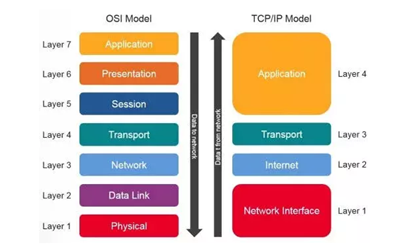
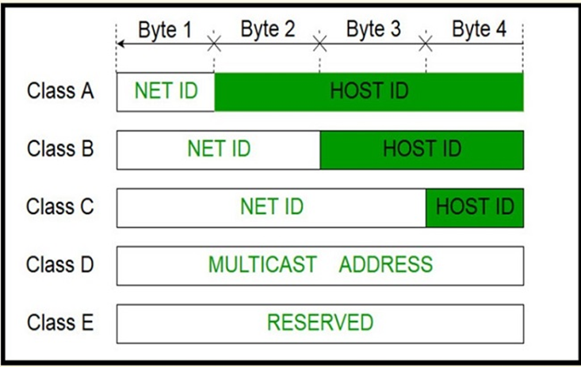
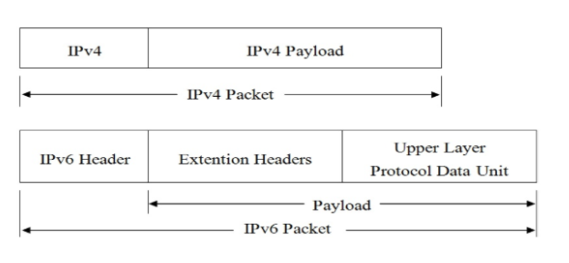

# 1. OSI – open systems interconnection model

Cung cấp tiêu chuẩn chung để các NSX phần cứng và phần mềm có thể phát triển các sản phẩm tương thích, cho phép các hệ thống mạng khác nhau giao tiếp với nhau 1 cách hiệu quả, bất kể công nghệ cơ bản của chúng là gì
7 layers:
Layer 7: application (ứng dụng) – là lớp duy nhất tương tác trực tiếp với người dùng và các ứng dụng phần mềm, là nơi các giao thức cho phép người dùng truy cập vào mạng và tài nguyên mạng
Chức năng:

- Giao diện người dùng
- Xác định đối tác giao tiếp
- Đồng bộ hóa truyền thông
  Giao thức tiêu biểu: HTTP/HTTPS, FTP, SMTP, DNS
  Layer 6: Presentation (trình bày) – là lớp đảm bảo rằng dữ liệu được truyền từ lớp ứng dụng của hệ thống gửi có thể được hiểu và sử dụng bởi lớp ứng dụng của hệ thống nhận
  Chức năng:
- Dịch thuật: từ định dạng độc lập sang định dạng chuẩn chung
- Mã hóa và Giải mã: liên kết các giao thức bảo mật ( SSL/TLS)
- Nén và giải nén => tăng tốc độ truyền tải và hiệu suất mạng
  Layer 5: session (phiên) – thiết lập, quản lý, đồng bộ hóa và kết thúc các phiên làm việc hoặc đối thoại giữa 2 ứng dụng
  Chứng năng:
- Thiết lập, quản lý và kết thúc phiên
- Đồng bộ hóa
- Quản lý hộp thoại: ( full-duplex , half-duplex)
  Layer 4: Transport ( vận chuyển) - chịu trách nhiệm về giao tiếp logic giữa các ứng dụng chạy trên các máy chủ khác nhau
  Chức năng: Phân đoạn dữ liệu và kiểm soát luồng
  Hai giao thức chính:

1. TCP

- Hướng kết nối: thiết lập phiên 3 bước trước khi truyền
- Đáng tin cậy
- Dùng cho: Web (HTTP), email (SMTP), truyền file (FTP)

2. UDP

- Không kết nối: gửi dữ liệu đi mà k cần xác nhận
- Ưu tiên tốc độ
- Dùng cho: Streaming video, DNS queries, Game online
  Layer 3: Network(mạng) - là lớp chịu trách nhiệm chính về việc định tuyến (routing) và đánh địa chỉ logic (logical addressing) để vận chuyển các gói dữ liệu (packets) từ mạng nguồn đến mạng đích
  Chức năng:
- Định tuyến: Xác định đường đi tối ưu
- Đánh địa chỉ Logic: sử dụng địa chỉ IP
- Đóng gói: Lớp Mạng nhận các phân đoạn (Segments) từ Lớp Vận chuyển (Layer 4), sau đó thêm tiêu đề IP (IP Header) (chứa địa chỉ IP nguồn và đích) để tạo thành Gói dữ liệu (Packet).
  Giao thức tiêu biển: IP (Internet Protocol), ICMP (Ping), , Router, Giao thức Định tuyến (Routing Protocols) (OSPF, EIGRP, BGP), Giao thức Hỗ trợ (Support Protocols) (ICMP,ARP)
  Đơn vị dữ liệu: Packet (gói tin)
  Layer 2: data link (liên kết dữ liệu) - là lớp chịu trách nhiệm chính về việc truyền tải dữ liệu (dưới dạng Khung/Frame) giữa hai thiết bị nằm trên cùng một mạng cục bộ (Local Area Network - LAN), sử dụng địa chỉ vật lý (MAC Address)
  Chức năng:
- Đóng gói :Lớp 2 nhận gói dữ liệu (Packet) từ Lớp Mạng (Layer 3) và thêm tiêu đề (Header) cùng phần cuối (Trailer) để tạo thành một Khung (Frame).
- Đánh địa chỉ vật lý: sử dụng địa chỉ MAC
- Kiểm soát truy caaph phương tiện
- Kiểm soát lỗi
  Giao thức tiêu biểu: Ethernet, Switch
  Đơn vị dữ liệu: Frame ( khung)
  Layer 1: Phsical( vật lý)- Là lớp chịu trách nhiệm chính về việc truyền tải dòng bit (stream of bits) thô, không có cấu trúc, qua các phương tiện truyền dẫn vật lý
  Chức năng:
- Mã hóa và truyền tín hiệu
- Xác định đặc điểm vật lý và xác định mức điện áp, tốc độ thay đổi tín hiệu và các đặc điểm điện học khác
- Cấu trúc liên kết vật lý: hình sao, hình bus
- Xác định hướng truyền tải: Đơn công (Simplex - một chiều), Bán song song (Half-Duplex - hai chiều luân phiên), hay Song công toàn phần (Full-Duplex - hai chiều đồng thời)
  Thiết bị tiêu biểu: Cáp mạng (cáp đồng, cáp quang, không dây), Hub (Thiết bị nhận tín hiệu và phát lại cho tất cả các cổng khác mà không phân biệt địa chỉ.), Repeater (Thiết bị khuếch đại tín hiệu để kéo dài phạm vi mạng.)

---

# 2. TCP/IP

Là giao thức điều khiển truyền nhận, giao thức liên mạng. Đây là một bộ giao thức trao đổi thông tin dùng để truyền tải và kết nối các thiết bị trong hệ thống mạng Internet
TCP: Giao thức TCP dùng để xác định các ứng dụng và tạo ra các kênh giao tiếp. TCP còn có chức năng quản lý các thông tin được chia nhỏ để truyền tải qua Internet. Giao thức TCP này sẽ tổng hợp và xử lý các thông tin này theo đúng thứ tự để đảm bảo truyền tải thông tin chính xác đến địa chỉ cần đến.
IP: Giao thức đảm bảo truyền tải thông tin đến đúng địa chỉ. IP sẽ gán từng địa chỉ và định tuyến từng điểm thông tin. Mỗi mạng chỉ có 1 địa chỉ IP để xác định chính xác nơi chuyển/nhận dữ liệu, thông tin
Layer 4: Application ( ứng dụng)
Tầng này tương tác trực tiếp với người dùng và các ứng dụng, chịu trách nhiệm xử lý dữ liệu từ người dùng
Giao thức phổ biến: HTTP, HTTPS, FTP, SMTP, DNS
Layer 3: transport ( vận chuyển)
Đảm bảo dữ liệu được truyền tải một cách chính xác và đầy đủ
Giao thức chính: TCP (Transmission Control Protocol): Đảm bảo việc truyền tải dữ liệu an toàn, có xác thực. UDP (User Datagram Protocol): Dữ liệu được truyền nhanh chóng nhưng không bảo đảm độ chính xác
Layer 2: Internet ( mạng)
Đảm bảo dữ liệu được gửi từ nguồn đến đích qua các mạng khác nhau, sử dụng địa chỉ IP
Giao thức chính: IP (Internet Protocol), ICMP (Internet Control Message Protocol), ARP (Address Resolution Protocol)
Layer 1: network access ( liên kết dữ liệu)
Đảm bảo dữ liệu được truyền qua các phương tiện vật lý (mạng cục bộ hoặc mạng diện rộng)
Giao thức phổ biến: Ethernet, Wi-Fi
\_\_

So sánh:

1. Sự đơn giản

- TCP/IP có 4 tầng, trong khi OSI có 7 tầng. Điều này làm cho TCP/IP trở nên đơn giản và dễ áp dụng hơn trong các ứng dụng thực tế
- OSI phân chia rõ ràng từng lớp chức năng, trong khi TCP/IP có thể kết hợp một số tầng của OSI vào một tầng

2. Ứng dụng thực tế

- TCP/IP đã được triển khai và sử dụng rộng rãi trong mọi mạng, bao gồm cả Internet, trong khi OSI chủ yếu là một mô hình lý thuyết để hiểu về các giao thức mạng
- Hầu hết các giao thức trong TCP/IP đều thực tế và được sử dụng cho các hệ thống mạng hiện đại, trong khi các giao thức của OSI không được triển khai nhiều trong các mạng thực tế

3. Tính linh hoạt

- TCP/IP có tính linh hoạt cao và hỗ trợ nhiều giao thức khác nhau cho từng ứng dụng cụ thể (HTTP, FTP, SMTP...), trong khi OSI chủ yếu là một khung lý thuyết không quy định cụ thể giao thức
  => TCP/IP thực tế hơn và được sử dụng rộng rãi trong các mạng toàn cầu, mô hình OSI giúp hiểu rõ cấu trúc lý thuyết của các giao thức mạng, trong khi TCP/IP là bộ giao thức thực tế được áp dụng trong các ứng dụng mạng
  \_\_

# 4. UDP

Là Giao thức dữ liệu người dùng là một giao thức giao tiếp thay thế cho TCP (Transmission Control Protocol) hoạt động ở lớp giao vận (Transport layer) – giao thức kiểm soát đường truyền, được sử dụng chủ yếu để thiết lập các kết nối có độ trễ thấp và không chịu lỗi giữa các ứng dụng trên internet

Đặc điểm:

- k thiết lập kết nối trước khi truyền
- Không đảm bảo truyền dữ liệu đáng tin cậy
- K kiểm soát tốc độ truyền dữ liệu
- K đảm bảo dữ liệu đến đích đúng thứ tự gửi
  Cách hoạt động
- Tạo gói dữ liệu với tiêu đề và tải trọng
- Truyền tải mà k cần bất kỳ quá trình bắt tay hay xác nhận nào
- Định tuyến dựa trên d/c IP đích
- Tiếp nhận: khi gói tin UDP đến máy chủ đích, ngăn xếp giao thức UDP sẽ chuyển tiếp gói tin đó đến ứng dụng thích hợp dựa trên số cổng đích được chỉ định trong tiêu đề
- Xử lý dữ liệu: trích xuất dữ liệu và xử lý, k lắp ráp lại các gói tin hoặc đảm bảo đến đúng thứ tự như TCP
- K có giai đoạn kết thúc kêt nối, quá trình giao tiếp hoàn tất sau khi gói tin UDP đc gửi đi
  Chức năng:
- Phù hợp các ứng dụng chạy thời gian thực
- Có thể sử dụng cho các giao thức dựa trên giao dịch
- Hữu ích khi có nhiều ng truy cập, kết nối và khi k có nhu cầu điều chỉnh lỗi thời gian thực
  Ưu điểm:
- Tốc độ và hiệu suất cao
- Tiết kiệm tài nguyên
- Hỗ trợ multicast và broadcast
- Giảm độ trên và tăng tốc độ truyền tải với các ứng dụng k yêu cầu đáng tin cậy hoặc k quan trọng
  Nhược điểm:
- K đảm bảo tính đáng tin cậy
- K hỗ trợ kiểm soát luồng
- K hỗ trợ xác nhận giao nhận dữ liệu
  TCP - Giao thức Điều khiển Truyền dẫn (TCP) là giao thức tiêu chuẩn trên internet hoạt động ở lớp Giao vận (Transport layer) được sử dụng để đảm bảo sự thành công trong quá trình trao đổi các gói dữ liệu giữa các thiết bị mạng. Hiện tại, TCP là giao thức truyền thải cơ bản cho nhiều ứng dụng khác nhau trong đó phải kể đến máy chủ web, trang web, ứng dụng email, FTP và các ứng dụng ngang hàng. Giao thức TCP nằm trong lớp vận chuyển (lớp 4 trong mô hình OSI)
  Đặc điểm:
- Thiết lập kết nỗi trước khi truyền dữ liệu
- Đảm bảo truyền dữ liệu đáng tin cậy
- Kiểm soát luồng dữ liệu
- Đảm bảo dữ liệu đc truyền đến địch theo đúng thứ tự
  Cách hđ: SYN -> SYN-ACK -> ACK -> sẵn sàng truyền dữ liệu
  Chức năng:
- Thiết lập kết nối
- Phân mảnh và gói tin hóa
- Kiểm soát luồng dữ liệu
- Bảo đảm độ tin cậy
- Đóng kết nối nhanh
  Ưu điểm:
- Là một trong số những giao thức internet đảm bảo an toàn, đáng tin cậy
- Được hỗ trợ cơ chế kiểm tra lỗi và phục hồi
- Dễ dàng kiểm soát dòng lưu lượng trong quá trình sử dụng
- TCP đảm bảo dữ liệu của bạn được gửi đến đúng đích theo thứ tự được gửi đi
- Vì TCP là giao thức mở nên không thuộc bất cứ một tổ chức hay cá nhân nào
- Giao thức TCP sẽ gắn một địa chỉ IP cho mỗi máy tính trên internet và một tên miền riêng cho từng ra. Vì vậy mỗi trang thiết bị đều được phân biệt rõ ràng qua internet
  Nhược điểm:
- Vì TCP được tạo ra để dành cho mạng WAN nên kích thước của nó luôn là vấn đề với những mạng nhỏ có ít băng thông
- TCP hoạt động trên nhiều lớp vì thế sẽ khiến cho tốc độ mạng bị chậm
- TCP không thể biểu diễn các giao thức nào ngoài TCP/IP
- Chưa được sửa lỗi bất cứ lần nào kể từ khi phát triển

---

# 5.

Các giao thức mạng chính (HTTP/HTTPS, DNS, FTP, SSH, DHCP, ARP, SMTP, SNMP) là tập hợp quy tắc chuẩn hóa giúp thiết bị trao đổi dữ liệu, hoạt động chủ yếu ở tầng Ứng dụng (Application) và Vận chuyển (Transport). Chúng vận hành dựa trên mô hình Client-Server, sử dụng cổng (port) cụ thể để truyền tải tin cậy (TCP) hoặc nhanh chóng (UDP)

1. HTTP/HTTPS (Web)
   Thành phần: Client (trình duyệt), Server, Request/Response Header, URL, Body.
   Cơ chế:

- HTTP (80): Gửi yêu cầu (GET/POST) dạng văn bản thuần, không mã hóa.
- HTTPS (443): Sử dụng SSL/TLS để mã hóa dữ liệu, đảm bảo bảo mật.
  Cài đặt/Cấu hình: Cài đặt Web Server (Apache/Nginx/IIS). Cấu hình virtual host, cài đặt chứng chỉ SSL (Let's Encrypt) trên Nginx (file nginx.conf) hoặc Apache

2. DNS (Domain Name System)
   Thành phần: Resolver, Root Server, TLD Server, Authoritative Server, Bản ghi (A, CNAME, MX).
   Cơ chế: Chuyển đổi tên miền (ví dụ: google.com) thành địa chỉ IP thông qua truy vấn phân cấp.
   Cài đặt/Cấu hình: Cài đặt Bind9 (Linux) hoặc Active Directory DNS (Windows). Cấu hình file /etc/bind/named.conf để tạo Zone file cho tên miền
3. FTP (File Transfer Protocol)
   Thành phần: Client, Server, Cổng lệnh (21), Cổng dữ liệu (20).
   Cơ chế: Kết nối TCP, gửi lệnh trên 21, chuyển dữ liệu trên 20 (chủ động) hoặc cổng ngẫu nhiên (bị động).
   Cài đặt/Cấu hình: vsftpd (Linux) hoặc FileZilla Server (Windows). Cấu hình trong vsftpd.conf: cho phép anonymous, local user, firewall mở cổng 20-21
4. SSH (Secure Shell)
   Thành phần: Client (PuTTY/Terminal), Server (sshd), Cặp khóa (public/private key)
   Cơ chế: Thiết lập kết nối mã hóa,xác thực bằng password hoặc key,chạy lệnh từ xa
   Cài đặt/Cấu hình: openssh-server. File cấu hình: /etc/ssh/sshd_config (đổi port, tắt root login, dùng key authentication
5. DHCP (Dynamic Host Configuration Protocol)
   Thành phần: DHCP Server, Client, Pool IP, Lease Time
   Cơ chế: DORA (Discover, Offer, Request, Acknowledge) - Tự động cấp phát IP
   Cài đặt/Cấu hình: isc-dhcp-server. Cấu hình trong /etc/dhcp/dhcpd.conf: định nghĩa subnet, range IP, gateway, DNS
6. ARP (Address Resolution Protocol)
   Thành phần: Bảng ARP cache, ARP Request/Reply (Broadcast)
   Cơ chế: Ánh xạ địa chỉ IP (lớp 3) sang địa chỉ MAC (lớp 2) để truyền tin trong mạng cục bộ (LAN)
   Cài đặt/Cấu hình: Hoạt động tự động trong tầng liên kết dữ liệu, không cần cài đặt
7. SMTP (Simple Mail Transfer Protocol)
   Thành phần: Mail User Agent (MUA), Mail Transfer Agent (MTA)
   Cơ chế: Gửi thư (Port 25/587) từ client đến mail server hoặc giữa các mail server
   Cài đặt/Cấu hình: Postfix hoặc Exim (Linux). Cấu hình trong /etc/postfix/main.cf để relay mail và xác thực
8. SNMP (Giao thức quản lý mạng đơn giản)
   Thành phần: SNMP Manager, Managed Device, SNMP Agent, MIB (Cơ sở thông tin quản lý).
   Cơ chế: Giám sát và quản lý các thiết bị mạng qua cổng UDP 161, 162. Manager truy vấn dữ liệu từ Agent trên các thiết bị để theo dõi tình trạng hệ thống.
   Cài đặt & Cấu hình: Cài đặt snmpd bằng sudo apt install snmpd. Cấu hình cộng đồng truy cập (Community string) và quyền đọc/ghi trong
   \_\_

# 6. Ipv4 / Ipv6

**Ipv4**

A: 0… ( 1.0.0.0 đến 126.255.255.255 )
Cho các mạng lớn với số lượng lớn các d/c IP
B: 10… ( 128.0.0.0 đến 191.255.255.255 )
Cho các mạng Tb với sl d/c IP vừa phải
C: 110… (192.0.0.0 đến 223.255.255.255 )
Cho các mạng nhỏ với sl d/c IP hạn chế
D: 1110…
Sử dụng cho multicast, từ 1 nguồn đến nhiều đích
E: từ 240 đến 255: dành riêng cho các mục đích đặc biệt hay dự phòng và k dc sd trong việc cấp phát địa chỉ IP cho mạng

**IPv6**

Payload: là sự kết hợp của Extension và PDU.Thông thường có thể lên tới 65535 byte.PDU thường bao gồm header của giao thức tầng cao và độ dài của nó, còn Extension là những thông tin liên quan đến dịch vụ kèm theo trong IPv6 được chuyển tới một trường khác và nó có thể có hoặc không.
IPv6 Header: là thành phần luôn phải có trong một gói tin IPv6 và cố định 40 bytes

- Version: 4 bits giúp xác định phiên bản của giao thức.
- Traffic class: 8 bits giúp xác định loại lưu lượng.
- Flow label: 20 bits giá mỗi luồng dữ liệu.
- Payload length: 16 bits (số dương).Giúp xác định kích thước phần tải theo sau IPv6 Header
- Next-Header: 8 bits giúp xác định Header tiếp theo trong gói tin
- Hop Limit: 8 bits (số dương). Qua mỗi node, giá trị này giảm 1 đơn vị ( giảm đến 0 thì gói bị loại bỏ).
- Source address: 128 bits mang địa chỉ IPv6 nguồn của gói tin.

---

# 7. VLAN

VLAN (Mạng LAN ảo) là một phân đoạn mạng logic trong mạng vật lý được tạo ra để nhóm các thiết bị dựa trên các yêu cầu chức năng, bất kể vị trí vật lý của chúng. VLAN giúp cải thiện quản lý mạng, giảm miền phát sóng, tối ưu hóa luồng lưu lượng và tăng cường bảo mật.
Mạng VLAN hoạt động ở Lớp 2 (Lớp Liên kết Dữ liệu) của mô hình OSI. Các thiết bị trong cùng một VLAN có thể giao tiếp như thể chúng đang ở trên cùng một mạng vật lý, ngay cả khi chúng nằm ở các phần khác nhau của cơ sở hạ tầng mạng.
Để thực hiện điều này, VLAN sử dụng một quy trình gọi là gắn thẻ khung (frame tagging). Một thẻ được thêm vào khung Ethernet khi dữ liệu được gửi giữa các thiết bị trong cùng một VLAN. Thẻ này chứa thông tin về VLAN mà khung dữ liệu thuộc về. Các switch sử dụng các thẻ này để chuyển tiếp khung dữ liệu chỉ đến các thiết bị trong cùng một VLAN, đảm bảo giao tiếp hiệu quả và được cách ly.
Lợi ích:

- Tăng cường bảo mật
- Hiệu suất mạng dc cải thiện
- Quản lý mạng dc đơn giản hóa
  \_\_
  Giao thức định tuyến (Routing Protocol) là tập hợp các quy tắc giúp thiết bị mạng (Router) tự động tìm, cập nhật và lựa chọn đường đi tối ưu cho gói tin đến đích, hoạt động chủ yếu ở Lớp 3 (Network Layer) mô hình OSI. Chúng được chia thành các loại chính như IGP (nội bộ, ví dụ: OSPF, RIP, EIGRP) và EGP (ngoại bộ, ví dụ: BGP)
  Định tuyến tĩnh là việc định tuyến mạng bằng cấu hình thủ công cố định các đường dẫn cho các thiết bị và không tự động thay đổi khi hệ thống mạng thay đổi. Với định tuyến tĩnh,router chuyển gói dữ liệu tới thiết bị dựa trên đ/c IP của thiết bị đích. Do đó, ta sẽ cần phải cấu hình lại định tuyến nếu muốn thay đổi mạng. Loại định tuyến này thường chỉ áp dụng với các mạng quy mô nhỏ và ít thay đổi cấu trúc mạng
  Định tuyến tĩnh có những ưu điểm nổi trội như ít tốn băng thông và CPU, dễ dàng cấu hình và nhà quản trị có toàn quyền quản lý định tuyến trong mạng. Việc sử dụng loại định tuyến này thường bắt gặp khi cần xác định phân chia mạng bằng cách tạo ra các phân đoạn trong mạng hoặc có thể xây dựng các đường dẫn riêng biệt cho các mạng con

---

# 8. NAT

Đây là kỹ thuật được sử dụng để chuyển đổi địa chỉ private IP (địa chỉ IP riêng) của các thiết bị trong một mạng LAN thành địa chỉ Public IP (địa chỉ IP công cộng) để giúp các thiết bị này có thể truy cập vào Internet
Với NAT nhiều thiết bị trong mạng LAN có thể sử dụng một địa chỉ IP công cộng duy nhất để hoạt động trên Internet.
