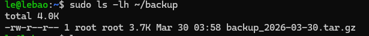

# 1. Tạo bash

tạo `sudo nano hello.sh`

cấu trúc script `#!/bin/bash ...` _#!/bin/bash gọi là shebang (chỉ định shell dùng để chạy)_

cấp quyền chạy `sudo chmod +x hello.sh`

chạy `./hello.sh`

# 2. câu lệnh cơ bản trong bash

- biến `name="bao"`, dùng `$name` _name="bao" không có khoảng trắng_

- nhập dữ liệu `read`

- in ra `echo`

- tìm kiếm `grep`

- xử lý text `awk`

- chỉnh sửa text `sed`

- cắt chuối `cut`

- thay thế ký tự `tr`

- so sánh `-eq` = , `-ne` ≠ , `-gt` > , `-lt'` <

- `set -e` khiến script dừng ngay lập tức khi một lệnh bất kỳ trả về exit code khác 0 (tức là lỗi).

- `set -u` khiến script bị lỗi ngay lập tức khi bạn sử dụng một biến chưa được khai báo (unset variable).

**if-else**

```bash
#!/bin/bash
read -p "Nhap a: " a
read -p "Nhap b: " b

echo "Tong: $((a+b))"

if (( $a % 2 == 0 ));then
echo "chan"
else echo "le"
fi
```

**vòng lặp**

```bash
for i in 1 2 3 4 5
do
echo "So: $i"
done
```

```bash
i=1
while [ $i -le 5 ]
do
echo $1
((i++))
done
```

**hàm**

```bash
hello() {
echo "Hello $1"
}
hello Bao
```

**check service nginx**

```bash
#!/bin/bash

if systemctl is-active --quiet nginx
then
    echo "Nginx running"
else
    echo "Nginx has been stoped"
fi
```

**chạy debug** `bash -x script.sh`

# 3. xử lý hệ thống

## 3.1 xử lý file

**đọc theo dòng**

```bash
#!/bin/bash

while read line
do
    echo "Dong: $line"
done < file.txt
```

_Dùng khi xử lý file lớn, log, danh sách user…_

**kiểm tra file tồn tại**

```bash
#!/bin/bash
read -p "file name:" a
if [ -f $a ]; then
    echo "File ton tai"
else echo "file k ton tai"
fi
```

**đếm số lỗi trong log**

```bash
#!/bin/bash

log="/var/log/syslog"

count=$(grep -i "error" $log | wc -l)

echo "So loi: $count"
```

**backup đơn giản**

```bash
#!/bin/bash

src="/home"
dest="/home/le/backup"
mkdir -p "$dest"
tar -czf $dest/backup_$(date +%F).tar.gz $src

echo "Backup done!"
```



**xóa file cũ**

```bash
#!/bin/bash

find /backup -name "*.tar.gz" -mtime +7 -delete

echo "Da xoa file cu"
```

**minitor server - bật nginx**

```bash
if systemctl is-active --quiet nginx
then
   echo "OK"
else
   systemctl start nginx
fi
```

## 3.2. cronjob

**cron**

`* * * * * command`
_phút(0-59) giờ(0-23) ngày(1-31) tháng(1-12) thứ(1-7)_

**dọn log tự động**

mở cron `crontab -e`

xóa log quá 7 ngày `*/10 * * * * find /var/log -name "*.log" -mtime +7 -delete`

**monitor server - check cpu**

```bash
#!/bin/bash

cpu=$(top -bn1 | grep "Cpu" | awk '{print $2}')

echo "Time: $(date +"%T")  CPU: $cpu%" >> /home/le/monitor.log
```

cron `*/5 * * * * /home/monitor.sh`

# 4. tự động hóa bằng bash

**monitor server - CPU/ RAM/ DISK**

kiểm tra tài nguyên -> ghi log -> cảnh báo nếu vượt ngưỡng

```bash
#!/bin/bash

LOG="/var/log/monitor.log"

# CPU usage
cpu=$(top -bn1 | grep "Cpu" | awk '{print $2}' | cut -d. -f1)

# RAM usage
ram=$(free | grep Mem | awk '{print $3/$2 * 100.0}')
ram=${ram%.*}

# Disk usage
disk=$(df / | tail -1 | awk '{print $5}' | tr -d '%')

echo "$(date) | CPU: $cpu% | RAM: $ram% | DISK: $disk%" >> $LOG

# cảnh báo
if [ "$cpu" -gt 80 ]; then
   echo "CPU cao: $cpu%" >> $LOG
fi

if [ "$ram" -gt 80 ]; then
   echo "RAM cao: $ram%" >> $LOG
fi

if [ "$disk" -gt 80 ]; then
   echo "DISK cao: $disk%" >> $LOG
fi
```

cron `*/5 * * * * /home/le/mosv.sh`
xem `cat /var/log/monitor.log`

**auto restart service**

```bash
#!/bin/bash

SERVICE="nginx"

if systemctl is-active --quiet $SERVICE
then
    echo "$(date): $SERVICE OK"
else
    echo "$(date): $SERVICE DOWN → restart"
    systemctl start $SERVICE
fi
```

cron `*/2 * * * * /home/le/restart.sh`

**tạo user tự động**

đọc file và tạo user từ file

_users.txt_

```bash
user1
user2
user3
```

```bash
#!/bin/bash

while read user
do
    useradd $user
    echo "$user:123456" | chpasswd
    echo "Created $user"
done < users.txt
```
