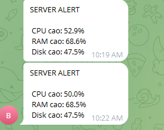
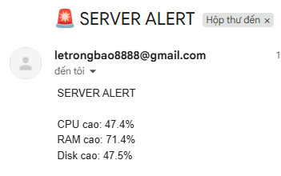

# 1. python cơ bản

kiểm tra `python3 --version`

chạy trực tiếp `python3`

chạy file .py `nano hello.py` -> `python3 hello.py`

**virtual environment**

giúp tránh xung đột package

```bash
sudo apt install python3-venv -y
python3 -m venv myenv
source myenv/bin/activate
```

**quản lý thư viện với pip**

cài thư viện `pip3 install requests`
_dùng trong virtual environment_

vd dùng thư viện requests để gửi HTTP requests đến api github

```bash
import requests
r = requests.get("https://api.github.com")
print(r.status_code)
```

**viết script CLI**

```bash
import sys

if len(sys.argv) < 3:
    print("Usage: script.py <name> <old>")
else:
    print(f"Hello {sys.argv[1]}")
    print(f"i am {sys.argv[2]}")
```

chạy `python3 excli.py bao 12`

**biến python thành lệnh linux**

```bash
#!/usr/bin/env python3
print("Hello from tool")
```

```bash
chmod +x mytool.py
sudo mv mytool.py /usr/local/bin/mytool
```

chạy `mytool`

**ví dụ tự động deploy CI/CD**

```bash
import os

# pull code mới
os.system("git pull origin main")

# restart web
os.system("systemctl restart nginx")
```

**gọi docker API**

```bash
import docker

client = docker.from_env()

# chạy container
container = client.containers.run("nginx", detach=True, ports={'80':80})

print(container.id)
```

# 2. python cho quản trị hệ thống

**chạy lệnh linux bằng python**

lệnh df -h

```bash
import os

os.system("df -h")
```

lệnh ls

```bash
import subprocess

result = subprocess.run(["ls", "-l"], capture_output=True, text=True)
print(result.stdout)
```

**đọc file log**

```bash
with open("/var/log/syslog", "r") as f:
    for line in f.readlines()[-10:]:
        print(line)
```

**kiểm tra service**

```bash
import subprocess

service = "nginx"
status = subprocess.run(["systemctl", "is-active", service], capture_output=True, text=True)

print(f"{service}: {status.stdout}")
```


**backup**

```bash
import os
os.system("tar -czf /home/le/backup/home.tar.gz /home/le/python")
```

cron `0 2 * * * /usr/bin/python3 /home/user/backup.py`

**check ram, disk, cpu**

```bash
import psutil

print("CPU:", psutil.cpu_percent(), "%")
print("RAM:", psutil.virtual_memory().percent, "%")
print("Disk:", psutil.disk_usage('/').percent, "%")
```

# 3. alert telegram

lấy BOT_TOKEN trong chatbot
tìm `"chat":{"id":...}` trong `curl https://api.telegram.org/bot<TOKEN>/getUpdates`

cấu trúc

```bash
server-monitor/
│
├── monitor.py
├── config.py
└── requirements.txt
```

file config.py

```bash
BOT_TOKEN = "your_bot_token"
CHAT_ID = "your_chat_id"

# Ngưỡng cảnh báo
CPU_THRESHOLD = 80
RAM_THRESHOLD = 80
DISK_THRESHOLD = 80

# Service cần check
SERVICES = ["nginx", "ssh"]
```

file monitor

```bash
import psutil
import requests
import subprocess
from config import *

def send_telegram(message):
    url = f"https://api.telegram.org/bot{BOT_TOKEN}/sendMessage"
    data = {
        "chat_id": CHAT_ID,
        "text": message
    }
    requests.post(url, data=data)

# ======================
# CHECK CPU / RAM / DISK
# ======================

def check_system():
    alerts = []

    cpu = psutil.cpu_percent()
    ram = psutil.virtual_memory().percent
    disk = psutil.disk_usage('/').percent

    if cpu > CPU_THRESHOLD:
        alerts.append(f" CPU cao: {cpu}%")

    if ram > RAM_THRESHOLD:
        alerts.append(f" RAM cao: {ram}%")

    if disk > DISK_THRESHOLD:
        alerts.append(f" Disk cao: {disk}%")

    return alerts

# ======================
# CHECK SERVICE
# ======================

def check_services():
    alerts = []

    for service in SERVICES:
        result = subprocess.run(
            ["systemctl", "is-active", service],
            capture_output=True,
            text=True
        )

        if "inactive" in result.stdout:
            alerts.append(f" Service {service} DOWN")
            subprocess.run(["systemctl", "restart", service])
                alerts.append(f"Đã restart {service}")

    return alerts

# ======================
# MAIN
# ======================

def main():
    alerts = []

    alerts.extend(check_system())
    alerts.extend(check_services())

    if alerts:
        message = " SERVER ALERT \n\n" + "\n".join(alerts)
        send_telegram(message)

if __name__ == "__main__":
    main()
```

file requirement.txt
`psutil requests`

chạy `python3 monitor.py`



## alert email

thêm config

```bash
# Email config
EMAIL_HOST = "smtp.gmail.com"
EMAIL_PORT = 587
EMAIL_USER = "you@gmail.com"
EMAIL_PASS = "your_app_password"
EMAIL_TO = "admin@example.com"
```

thêm vào monitor

```bash
import smtplib
from email.mime.text import MIMEText

def send_email(message):
    msg = MIMEText(message)
    msg["Subject"] = "🚨 SERVER ALERT"
    msg["From"] = EMAIL_USER
    msg["To"] = EMAIL_TO

    try:
        server = smtplib.SMTP(EMAIL_HOST, EMAIL_PORT)
        server.starttls()
        server.login(EMAIL_USER, EMAIL_PASS)
        server.send_message(msg)
        server.quit()
    except Exception as e:
        print("Send mail error:", e)
```

thêm `send_email(message)` vào `main()`



## monitor port/website

```bash
import socket
import requests
from config import *

def check_ports():
    alerts = []

    for port in PORTS:
        s = socket.socket()
        result = s.connect_ex(("127.0.0.1", port))
        if result != 0:
            alerts.append(f"Port {port} đóng")

    return alerts

def check_websites():
    alerts = []

    for url in WEBSITES:
        try:
            r = requests.get(url, timeout=5)
            if r.status_code != 200:
                alerts.append(f"Web lỗi: {url}")
        except:
            alerts.append(f"Web DOWN: {url}")

    return alerts
```

**thêm main()**
`alerts += check_ports() alerts += check_websites()`
**thêm config**
`PORTS = [80, 443]
WEBSITES = ["http://localhost"]`

## log

```bash
import logging
from config import LOG_FILE

logging.basicConfig(
    filename=LOG_FILE,
    level=logging.INFO,
    format="%(asctime)s - %(message)s"
)

def log(msg):
    logging.info(msg)
```

**thêm main()**
`log(message)`
**thêm config**
`LOG_FILE = "logs/app.log"`

## anti spam

```bash
import json
from config import STATE_FILE

def load_state():
    try:
        with open(STATE_FILE) as f:
            return json.load(f)
    except:
        return {}

def save_state(state):
    with open(STATE_FILE, "w") as f:
        json.dump(state, f)
```

# 4. các chức năng khác

**auto SSH**

```bash
import paramiko

ssh = paramiko.SSHClient()
ssh.set_missing_host_key_policy(paramiko.AutoAddPolicy())

ssh.connect("192.168.254.132", username="lbao", password="bao1944")

stdin, stdout, stderr = ssh.exec_command("uptime")

print(stdout.read().decode())

ssh.close()
```

**fabric (deploy server)**

```bash
from fabric import Connection

c = Connection("user@192.168.1.10")

c.run("cd /var/www && git pull")
c.run("systemctl restart nginx")
```

-> Deploy code hàng loạt, Thay thế bash script

**tạo wedserver bằng flask**

```bash
from flask import Flask

app = Flask(__name__)

@app.route("/")
def home():
    return "Server OK"

app.run(host="0.0.0.0", port=5000)
```
