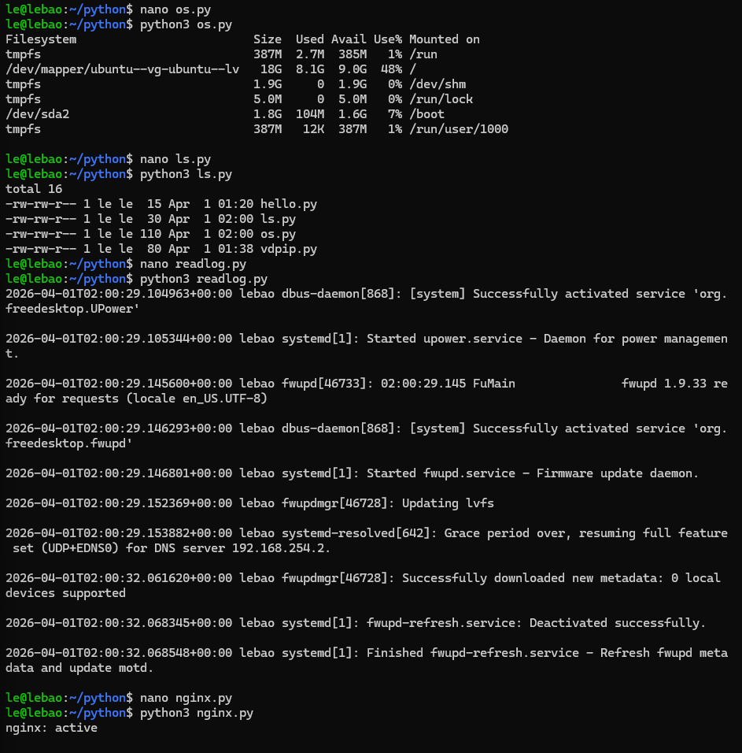

# 1. python cơ bản

kiểm tra `python3 --version`

chạy trực tiếp `python3`

chạy file .py `nano hello.py` -> `python3 hello.py`

**virtual environment**

giúp tránh xung đột package

```bash
sudo apt install python3-venv -y
python3 -m venv myenv
source myenv/bin/activate
```

**quản lý thư viện với pip**

cài thư viện `pip3 install requests`
_dùng trong virtual environment_

vd dùng thư viện requests để gửi HTTP requests đến api github

```bash
import requests
r = requests.get("https://api.github.com")
print(r.status_code)
```

# 2. python cho quản trị hệ thống

**chạy lệnh linux bằng python**

lệnh df -h

```bash
import os

os.system("df -h")
```

lệnh ls

```bash
import subprocess

result = subprocess.run(["ls", "-l"], capture_output=True, text=True)
print(result.stdout)
```

**đọc file log**

```bash
with open("/var/log/syslog", "r") as f:
    for line in f.readlines()[-10:]:
        print(line)
```

**kiểm tra service**

```bash
import subprocess

service = "nginx"
status = subprocess.run(["systemctl", "is-active", service], capture_output=True, text=True)

print(f"{service}: {status.stdout}")
```


